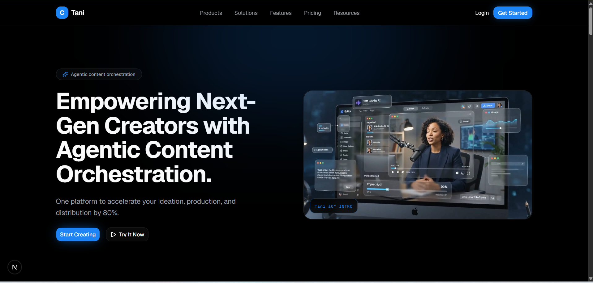
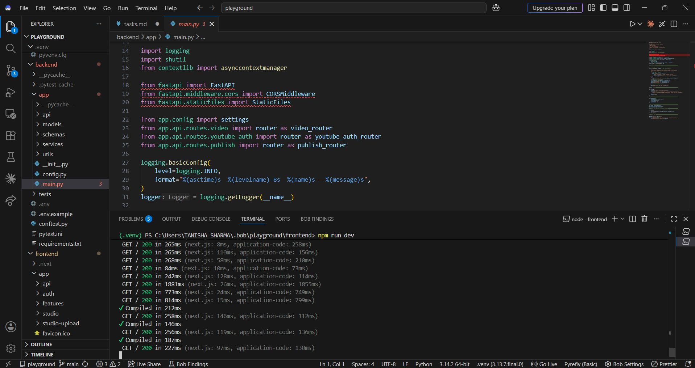
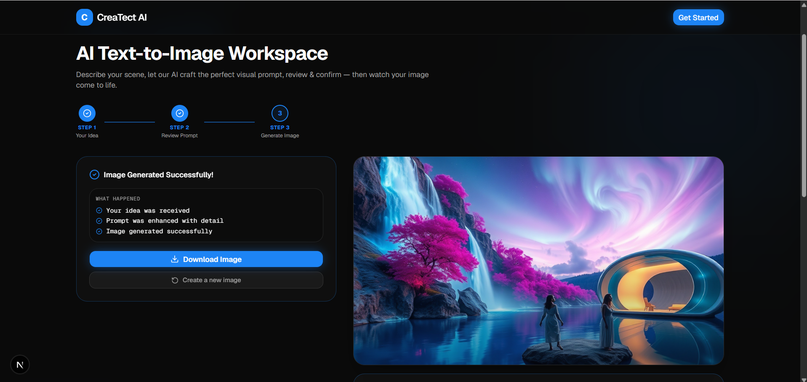
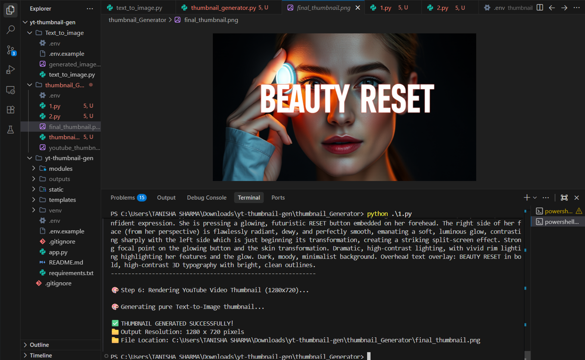

# Tani — Agentic Content Orchestration Platform

<div align="center">


**One platform to accelerate your content ideation, production, and distribution by 80%.**

</div>

---

## 🖥️ Platform Preview



> *The main landing page — dark cinematic UI with glowing accents.*

---

## IBM AI Builders Challenge 2026 — Submission

| Field | Details |
|---|---|
| **Challenge Theme** | Agentic AI for Content Creation & Distribution |
| **Primary IBM Tool** | **IBM Bob** (AI Software Engineer) |
| **IBM AI Model** | **IBM Granite 3.0** (`ibm-granite/granite-3.0-8b-instruct`) |
| **IBM Platform** | **IBM watsonx.ai** — Granite inference via HuggingFace |
| **Team** | Tanisha Sharma · Jeneesh Vandra |

---

## Problem Statement

Content creators face a **brutal production bottleneck**:

- A single 1-hour podcast or interview contains **dozens of viral moments** — but identifying them manually takes 4–8 hours of editing work.
- After clipping, creators must still **write titles, descriptions, hashtags**, generate **thumbnails**, create **B-roll visuals**, and **distribute** across 5+ platforms.
- Most AI tools solve **one** part of this workflow — forcing creators to juggle 6+ disconnected apps.
- **80% of creator time** is spent on repetitive post-production instead of making content.

> **Result:** Great content never gets made because the production pipeline is too slow and expensive.

---

## Solution Description

**Tani** is a fully integrated, AI-orchestrated content platform that takes a raw long-form video and **autonomously handles every stage** of the creator workflow:

```
Raw Video -> Transcription -> Viral Analysis -> 9:16 Clip Rendering
          -> Metadata Generation -> YouTube Publishing -> Done
```

Additionally:
- **Text-to-Image**: Generate B-roll visuals from a text prompt in seconds
- **AI Thumbnail Generator**: Create scroll-stopping YouTube thumbnails with one click

Everything lives in **one unified dark-themed platform** — no switching between tools.

---

## AI Approach & Architecture

### System Architecture

```
+------------------------------------------------------------------+
|                       FRONTEND (Next.js 16)                      |
|  Landing Page -> Upload Studio -> Video Studio -> Feature Pages  |
|  Text-to-Image Workspace | Thumbnail Generator | YouTube Publish |
+------------------------------+-----------------------------------+
                               | HTTP / REST
+------------------------------v-----------------------------------+
|                       BACKEND (FastAPI)                          |
|                                                                  |
|  +-------------+  +--------------+  +------------------------+  |
|  | Faster-     |  | IBM Granite  |  | FFmpeg Pipeline        |  |
|  | Whisper     |  | 3.0 via      |  | 9:16 Crop + Subtitles  |  |
|  | Transcribe  |  | watsonx.ai   |  | + Karaoke Captions     |  |
|  +------+------+  +------+-------+  +-----------+------------+  |
|         |                |                       |               |
|  +------v------+  +------v-------+  +-----------v------------+  |
|  | Word-level  |  | Viral Segment|  | YouTube Data API v3    |  |
|  | Timestamps  |  | Scoring 0-100|  | OAuth 2.0 Publishing   |  |
|  +-------------+  +--------------+  +------------------------+  |
+------------------------------------------------------------------+
                               |
+------------------------------v-----------------------------------+
|                    EXTERNAL AI SERVICES                          |
|  IBM Granite 3.0 (HuggingFace)  |  FLUX.1-schnell (HF Router)  |
|  Gemini 2.5 Flash (Prompt Eng)  |  Pyannote Speaker Diarization |
+------------------------------------------------------------------+
```

### AI Pipeline — Step by Step

| Step | Technology | What Happens |
|---|---|---|
| 1. Ingest | `yt-dlp` / File Upload | Download YouTube video or accept upload (up to 500MB) |
| 2. Transcribe | **Faster-Whisper** | Word-level timestamps with speaker detection |
| 3. Analyze | **IBM Granite 3.0** | LLM identifies top 5 viral segments, scores 0–100, generates hook text + script commentary |
| 4. Validate | `jsonschema` | Granite output validated against strict JSON Schema |
| 5. Diarize | **Pyannote.audio** | Speaker tracking for smart 9:16 crop positioning |
| 6. Render | **FFmpeg** | Trim + 9:16 crop + subtitle burn-in with karaoke timing |
| 7. Suggest | **IBM Granite** heuristics | Generate viral titles, descriptions, 30 hashtags |
| 8. Publish | **YouTube Data API v3** | Chunked resumable OAuth 2.0 upload -> live Shorts URL |

### IBM Granite 3.0 — Viral Analysis Prompt Strategy

IBM Granite 3.0 (`ibm-granite/granite-3.0-8b-instruct`) is the **core intelligence** of Tani:

- Receives the full word-level transcript as structured JSON
- Returns **exactly 5 viral clips** with: `start_time`, `end_time`, `hook_text`, `script_commentary`, `virality_score` (0–100), `virality_reasoning`
- Strict **JSON-only output** — no markdown, no prose
- Output validated with `jsonschema` — retry with stricter prompt on failure
- `tenacity` exponential backoff for HuggingFace rate limits (3 attempts)
- Fallback to **local Ollama** via `USE_OLLAMA=true` config flag

---

## IBM Tools — Detailed Usage

### 1. IBM Bob (AI Software Engineer)

> **IBM Bob is the AI software engineer that built this entire project.**

**IBM Bob** (`bob.ibm.com`) was used as the **primary development tool** throughout the entire project lifecycle:

#### What IBM Bob Built:
- Complete FastAPI backend — all 8 service modules, 3 API route files, Pydantic models, JSON schemas, pytest test suite
- Full Next.js frontend — landing page, video studio, text-to-image workspace, thumbnail generator, all 50+ React components
- YouTube OAuth 2.0 flow — complete Google OAuth integration with popup window, token exchange, chunked resumable upload
- IBM Granite integration — prompt engineering, JSON schema validation, retry logic with tenacity
- FFmpeg pipeline — 9:16 smart crop, subtitle burn-in, speaker-aware framing with Pyannote
- UI/UX integration — merged design system with functional backend, dark theme, all color tokens
- Bug fixes — resolved `httplib2` Windows redirect bug, Next.js Server/Client component split, dark theme visibility issues
- Git & deployment — `.gitignore`, secrets audit, README, GitHub push

#### IBM Bob's Coding Environment — Proof of Build



> *Every component, API route, and service module was written inside IBM Bob's native coding environment shown above.*

#### IBM Bob's Development Approach:
IBM Bob followed a **spec-driven, sequential implementation** plan (`tasks.md`) with:
- Modular service architecture (each service is independently testable)
- Type-safe TypeScript interfaces mirroring Pydantic models exactly
- Clean error handling at every layer (HTTP status codes, typed exceptions)
- Zero TypeScript errors (`npx tsc --noEmit` passes clean)

---

### 2. IBM Granite 3.0

**Model:** `ibm-granite/granite-3.0-8b-instruct` via **IBM watsonx.ai / HuggingFace Inference API**

**Role:** Core viral intelligence engine

```python
# How IBM Granite 3.0 is used in Tani
from huggingface_hub import InferenceClient

client = InferenceClient(model="ibm-granite/granite-3.0-8b-instruct")

# Granite receives the full transcript and returns structured viral clips
response = client.text_generation(
    prompt=_build_prompt(transcript),  # system + user prompt
    max_new_tokens=2048,
    temperature=0.2,                   # low temp for consistent JSON
)
# Output: {"clips": [{rank, start_time, end_time, hook_text, virality_score, ...}]}
```

**Granite handles:**
- Identifying the most engaging 30–60 second segments
- Scoring emotional impact and virality potential (0–100)
- Writing the "hook" — the opening line that makes viewers stop scrolling
- Explaining *why* each segment will go viral

---

## Selected Challenge Theme — July 2026

> ### 🎨 Reimagine Creative Industries with AI

AI is transforming how people create content, tell stories, design experiences, and bring ideas to life. Tani is our direct answer to this challenge — a fully agentic platform that reimagines every stage of the creator workflow, making professional-quality content production accessible to anyone with an idea.

---

### How can AI enhance creativity?

Traditional content creation demands that creators split their attention across dozens of repetitive, technical tasks — transcribing footage, cutting clips, writing titles, generating visuals, and distributing across platforms. Tani removes all of that friction.

By delegating the **technical layer entirely to AI**, creators reclaim their most valuable resource: creative focus. IBM Granite 3.0 doesn't just cut clips — it reads the emotional arc of a conversation, identifies the moment a story peaks, writes the hook that makes someone stop scrolling, and explains *why* that moment will resonate. The creator's voice and vision are amplified, not replaced.

- **AI-generated hooks** — Granite writes the opening line that captures attention in the first 3 seconds
- **Virality scoring** — Each clip is rated 0–100 with detailed reasoning, giving creators data-driven creative intuition
- **AI thumbnails** — FLUX.1-schnell generates scroll-stopping visuals from a platform-aware, style-aware prompt
- **Text-to-image B-roll** — Any scene a creator can describe in words, Tani renders as a cinematic image in seconds

---

### How can AI help people create faster?

A single 1-hour interview contains dozens of publishable moments. Manually finding them, cutting them to 9:16, writing metadata, and distributing them takes **4–8 hours per video**. Tani compresses that to **under 5 minutes** — an 80%+ time reduction.

The full pipeline is autonomous end-to-end:

| Step | Without Tani | With Tani |
|---|---|---|
| Transcription | 1–2 hrs manual review | < 60 sec — Faster-Whisper auto |
| Viral clip identification | 2–4 hrs scrubbing footage | < 30 sec — IBM Granite analysis |
| 9:16 rendering + captions | 1–2 hrs in editing software | < 2 min — FFmpeg pipeline |
| Titles, descriptions, hashtags | 30–60 min copywriting | < 10 sec — Granite metadata |
| YouTube publishing | Manual upload + form fill | One click — OAuth 2.0 API |
| **Total** | **4–8 hours** | **< 5 minutes** |

Tani demonstrates agentic speed through:

1. **Multi-step autonomy** — The pipeline runs from raw video to live YouTube URL with minimal human input
2. **Tool orchestration** — Whisper, Granite, FFmpeg, Pyannote, and YouTube API work as coordinated, specialized agents
3. **Self-validation** — Granite output is validated against a strict JSON schema; on failure, the agent retries automatically with a stricter prompt
4. **Adaptive routing** — Falls back to local Ollama if the cloud API is unavailable — zero downtime for creators
5. **Cross-platform distribution** — One clip, instantly formatted for YouTube Shorts, Instagram Reels, LinkedIn, and X

---

### How can AI unlock entirely new creative experiences?

Tani opens creative doors that simply didn't exist before:

- **Any creator can go viral** — You no longer need a professional editor or years of craft knowledge to produce platform-native short-form content. Tani's AI identifies the best moments even when the creator can't see them yet.
- **Real-time visual storytelling** — The text-to-image workspace lets creators generate B-roll, concept art, and visual metaphors from a single sentence — images that would require a full design team or stock licensing.
- **AI-generated thumbnails with brand intelligence** — The thumbnail generator understands platform context (YouTube vs. LinkedIn vs. Reels), visual style, mood, and facial expression — producing assets that used to take 30 minutes in Photoshop in under 10 seconds.
- **Speaker-aware cinematography** — Pyannote diarization combined with FFmpeg smart cropping means the camera follows the active speaker automatically, bringing broadcast-level production quality to amateur footage.
- **From idea to live video in one platform** — No switching between tools. The entire creative pipeline — from raw upload to live YouTube Shorts URL — happens inside a single, unified dark-themed workspace.

> Tani doesn't just make existing workflows faster. It makes *entirely new creative workflows possible* — for solo creators, small teams, and anyone who has a story to tell but not the time or resources to tell it professionally.

---

## Features

| Feature | Description |
|---|---|
| AI Video Clipping | Word-level transcription -> IBM Granite viral analysis -> 9:16 FFmpeg rendering with karaoke captions |
| YouTube Shorts Publishing | One-click Google OAuth 2.0 publish with chunked resumable upload |
| AI Metadata Generation | IBM Granite-powered title suggestions, 3 description variants, 30 viral hashtags |
| Download Clips | Download any rendered clip directly from the studio |
| Text-to-Image | Gemini-enhanced prompts -> FLUX.1-schnell via HuggingFace Router |
| Thumbnail Generator | Gemini scene synthesis -> FLUX.1-schnell with smart text overlay placement |
| Full Dark UI | Tani dark theme with brand color system — every page, every component |
| Multi-Platform Export | YouTube Shorts, Instagram Reels, LinkedIn, X — platform-specific metadata |

---

## 🖼️ Text-to-Image Generation



> *The AI Text-to-Image workspace — describe any scene, get a cinematic image in seconds using FLUX.1-schnell.*

**Pipeline:** Raw text → Gemini prompt enhancement → FLUX.1-schnell render → one-click download.

---

## 🎬 AI Thumbnail Generator



> *A fully generated thumbnail — platform-aware, style-aware, with smart text overlay placement.*

**5-step pipeline:** Platform → Title & overlay text → Category/style/background/mood → Face expression → Optional face upload → **Rendered thumbnail**.

---

## Tech Stack

### Backend
| Layer | Technology |
|---|---|
| Framework | **FastAPI 0.111** + Uvicorn |
| IBM AI | **IBM Granite 3.0** via HuggingFace / watsonx.ai |
| Transcription | **Faster-Whisper 1.0.3** (word-level timestamps) |
| Video Processing | **FFmpeg** + ffmpeg-python |
| Speaker Diarization | **Pyannote.audio 3.3.2** |
| YouTube API | google-api-python-client + google-auth-oauthlib |
| YouTube Download | yt-dlp |
| Retry Logic | tenacity (exponential backoff) |
| Config | pydantic-settings |

### Frontend
| Layer | Technology |
|---|---|
| Framework | **Next.js 16** (App Router, Turbopack) |
| Language | TypeScript 5 |
| Styling | **Tailwind CSS v4** + tw-animate-css |
| UI Components | shadcn/ui + @base-ui/react |
| Image Generation | FLUX.1-schnell via HuggingFace Router |
| Prompt Enhancement | Gemini 2.5 Flash |
| Icons | lucide-react |

---

## Project Structure

```
project-root/
+-- backend/                          # FastAPI Python backend
|   +-- app/
|   |   +-- main.py                   # App factory, CORS, router registration
|   |   +-- config.py                 # pydantic-settings env config
|   |   +-- api/routes/
|   |   |   +-- video.py              # /api/video/* (transcribe, analyze, process, status)
|   |   |   +-- youtube_auth.py       # /api/auth/youtube/* (OAuth 2.0)
|   |   |   +-- publish.py            # /api/publish/youtube (upload + AI suggestions)
|   |   +-- services/
|   |   |   +-- transcription_service.py   # Faster-Whisper integration
|   |   |   +-- granite_analyzer.py        # IBM Granite 3.0 LLM + JSON validation
|   |   |   +-- video_processor.py         # FFmpeg 9:16 smart crop pipeline
|   |   |   +-- subtitle_service.py        # .srt karaoke caption generation
|   |   |   +-- youtube_service.py         # yt-dlp YouTube download
|   |   |   +-- youtube_publisher.py       # YouTube Data API v3 chunked upload
|   |   +-- models/                    # Pydantic models
|   |   +-- schemas/                   # JSON Schema for Granite output validation
|   |   +-- utils/                     # FFmpeg + file utilities
|   +-- tests/                         # pytest test suite
|   +-- requirements.txt
|   +-- .env.example                   # Template only — NO real keys
|
+-- frontend/                          # Next.js unified frontend
|   +-- app/
|   |   +-- page.tsx                   # Tani landing page
|   |   +-- studio-upload/             # Video upload form
|   |   +-- studio/[jobId]/            # Video clipping studio
|   |   +-- auth/youtube/callback/     # OAuth 2.0 callback page
|   |   +-- features/
|   |   |   +-- video-clipping/        # Feature showcase -> studio
|   |   |   +-- text-to-image/         # Text-to-image workspace
|   |   |   +-- thumbnail-generator/   # Thumbnail generator workspace
|   |   +-- api/
|   |       +-- generate-image/        # FLUX.1 image generation
|   |       +-- enhance-prompt/        # Gemini prompt enhancement
|   |       +-- generate-thumbnail/    # Gemini + FLUX thumbnail
|   +-- components/
|   |   +-- home/                      # 9 landing page sections
|   |   +-- features/                  # Feature workspaces
|   |   +-- studio/                    # Video studio components
|   |   +-- upload/                    # Upload + progress components
|   |   +-- site-nav.tsx               # Sticky dark navigation
|   |   +-- site-footer.tsx            # Footer
|   +-- lib/api.ts                     # Typed fetch wrappers
|   +-- lib/types.ts                   # TypeScript interfaces
|   +-- .env.local.example             # Template only — NO real keys
|
+-- docs/
|   +-- screenshots/                   # Real proof-of-work screenshots
|       +-- landing-hero.png           # Main landing page
|       +-- image-generation-page.png  # Text-to-image workspace live
|       +-- thumbnail-generated.png    # Generated thumbnail result
|       +-- coding-environment.png     # IBM Bob coding environment
|
+-- README.md
+-- .gitignore                         # Blocks all .env files
+-- tasks.md                           # Full implementation spec
```

---

## Quick Start

### Prerequisites
- Python 3.11+ · Node.js 20+ · FFmpeg on PATH
- HuggingFace account (free tier) · Google Cloud project

### 1. Clone
```bash
git clone https://github.com/Tanisharma122/AI-Builders-Challeneg---IBM-BOB.git
cd AI-Builders-Challeneg---IBM-BOB
```

### 2. Backend
```bash
cd backend
pip install -r requirements.txt
cp .env.example .env
uvicorn app.main:app --reload --port 8000
```

### 3. Frontend
```bash
cd frontend
npm install
cp .env.local.example .env.local
npm run dev
```

### 4. Open
```
http://localhost:3000
```

---

## Environment Variables

### `backend/.env` (copy from `.env.example`)
```env
HF_API_KEY=hf_xxxx                    # HuggingFace — IBM Granite 3.0 inference
HF_TOKEN=hf_xxxx                      # HuggingFace — Pyannote gated model
WHISPER_MODEL_SIZE=base               # tiny | base | small | medium | large-v3
UPLOAD_DIR=/tmp/videoclip/uploads
OUTPUT_DIR=/tmp/videoclip/outputs
FFMPEG_PATH=ffmpeg
YOUTUBE_CLIENT_ID=your_client_id.apps.googleusercontent.com
YOUTUBE_CLIENT_SECRET=your_client_secret
YOUTUBE_REDIRECT_URI=http://localhost:3000/auth/youtube/callback
CORS_ORIGINS=["http://localhost:3000"]
```

### `frontend/.env.local` (copy from `.env.local.example`)
```env
NEXT_PUBLIC_API_URL=http://localhost:8000
GEMINI_API_KEY=your_gemini_key
HF_TOKEN=hf_xxxx
```

---

## API Reference

### Video Pipeline
| Method | Endpoint | Description |
|---|---|---|
| `POST` | `/api/video/transcribe` | Upload file or YouTube URL -> start job |
| `POST` | `/api/video/analyze` | Trigger IBM Granite viral analysis |
| `POST` | `/api/video/process` | Render 9:16 clips with FFmpeg |
| `GET` | `/api/video/status/{job_id}` | Poll job status + progress % |
| `GET` | `/api/video/analysis/{job_id}` | Fetch Granite analysis JSON |

### YouTube Publishing
| Method | Endpoint | Description |
|---|---|---|
| `GET` | `/api/auth/youtube/login` | Get Google OAuth consent URL |
| `GET` | `/api/auth/youtube/callback` | Exchange code for tokens |
| `POST` | `/api/publish/youtube` | Upload clip — returns live Shorts URL |
| `POST` | `/api/publish/youtube/suggest` | AI title + description + tag suggestions |

---

## Security

- No API keys are committed — all secrets live in `.env` / `.env.local` (git-ignored)
- `.gitignore` blocks all `*.env*` patterns at both root and frontend level
- Only `.env.example` and `.env.local.example` templates (placeholder values) are tracked
- YouTube tokens stored in `sessionStorage` only

---

## User Journey

```
http://localhost:3000  (Landing)
        |
/features/video-clipping  ->  "Start Clipping"
        |
/studio-upload  (Upload video or paste YouTube URL)
        |
/studio/{jobId}  (Live processing: Transcribe -> Analyze -> Render)
        |
Studio: Preview clips · Download · Publish to YouTube Shorts
        |
https://youtube.com/shorts/{video_id}  -- LIVE
```

---

## License

MIT — Built for the **IBM AI Builders Challenge 2026**.

---

<div align="center">

**Made with IBM Bob · IBM Granite 3.0 · IBM watsonx.ai**

*Tani — Empowering Next-Gen Creators with Agentic Content Orchestration*

</div>
